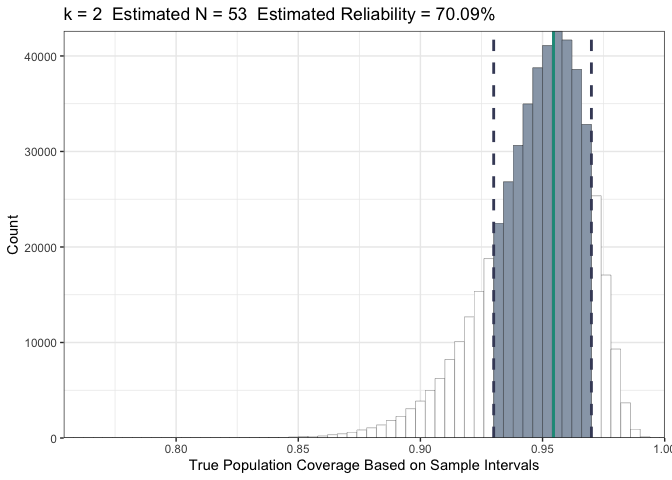

<!-- README.md is generated from README.Rmd. Please edit that file -->

# nterval  0.1.0.9000

<!-- badges: start -->

[](https://lifecycle.r-lib.org/articles/stages.html#experimental)
[](https://CRAN.R-project.org/package=nterval)
<!-- badges: end -->

The goal of nterval is to provide an approach for calculating the
minimum required sample size for estimation of population coverage
intervals (e.g., k-sigma intervals).

## Installation

Install the package using `devtools`:

``` r
# To install the most recent stable release of the package from Github
devtools::install_github("dygobeng/nterval@*release")

# To install the latest (development) version of the package from Github
devtools::install_github("dygobeng/nterval")
```

## Definitions

Before exploring an example, a few definitions:

-   The **target coverage** is the expected proportion of a
    Normally-distributed population that should be contained within the
    k-sigma parametric sample interval (e.g., a 3-sigma sample interval
    is expected to cover 99.73% of Normally-distributed observations).

-   The **sample coverage** is the proportion of a Normally-distributed
    population that *is* contained within the k-sigma interval estimated
    using a sample from the population.

-   The **upper and lower proximity limits** define the distance from
    the target coverage that an individual sample’s coverage can fall
    and still be considered “reasonably close” to the target. These
    bounds are useful for dialing in an acceptable

    -   *producer’s risk* by ensuring that the lower proximity limit
        does not move so low as to result in an unacceptable false
        positive rate (probability of flagging common cause variation),
        and

    -   *consumer’s risk* by ensuring that the upper proximity limit
        does not move so high as to result in an unacceptable false
        negative rate (probability of failing to flag special cause
        variation)

-   The **reliability** is the proportion of individual sample coverages
    expected to fall within the proximity limits.

## Example

A researcher would like to determine the minimum sample size required to
provide that a 2-sigma sample interval (with a targeted coverage of
95.44% when calculated using data that can be reasonably approximated by
a Normal distribution) will cover no less than 93% of the population and
no more than 97% of the population with 70% reliability.

We’ll use the `find_n_ksigma()` function to determine the required
sample size. The main arguments accept values for `k` (based on the
target coverage), the `proximity_range`, and the targeted `reliability`
(NOTE: The `seed` argument is used for reproducibility):

``` r
library(nterval)
```

``` r
find_n_ksigma(
  proximity_range = c(0.93, 0.97),
  reliability = 0.7,
  k = 2,
  seed = 12345
)
#> $sample_size
#> [1] 53
#> 
#> $k_constant
#> [1] 2
#> 
#> $reliability_hat
#> [1] 0.700928
```

The required sample size is correlated with the target reliability and
inversely correlated with the width of the proximity range:

``` r
# Increase targeted reliability to 80%
find_n_ksigma(
  proximity_range = c(0.93, 0.97),
  reliability = 0.8,
  k = 2,
  seed = 12345
)
#> $sample_size
#> [1] 79
#> 
#> $k_constant
#> [1] 2
#> 
#> $reliability_hat
#> [1] 0.8002

# Increase width of proximity range to 92% - 98%
find_n_ksigma(
  proximity_range = c(0.92, 0.98),
  reliability = 0.7,
  k = 2,
  seed = 12345
)
#> $sample_size
#> [1] 25
#> 
#> $k_constant
#> [1] 2
#> 
#> $reliability_hat
#> [1] 0.703056
```

There are some cases in which pre-specifying `k` may generate larger
sample sizes - for example, when the proximity limits are located
asymmetrically about the target coverage. In these situations, there is
evidence to suggest that setting `k` closer to the midpoint of the
proximity range may yield smaller sample sizes without loss of coverage.
As such, if a value for`k` is not specified it is set based on the
midpoint of `proximity_range`. Compare the following function
executions:

``` r
# Setting k = 2 (95.44% coverage)
find_n_ksigma(
  proximity_range = c(0.93, 0.96),
  reliability = 0.7,
  k = 2,
  seed = 12345
)
#> $sample_size
#> [1] 143
#> 
#> $k_constant
#> [1] 2
#> 
#> $reliability_hat
#> [1] 0.70016

# Allowing k to be set to the mid-point of the proximity range (0.945)
find_n_ksigma(
  proximity_range = c(0.93, 0.96),
  reliability = 0.7,
  seed = 12345
)
#> $sample_size
#> [1] 114
#> 
#> $k_constant
#> [1] 1.918876
#> 
#> $reliability_hat
#> [1] 0.701558
```

Setting `verbose = TRUE` provides real-time information on the progress
of the bisection algorithm.

``` r
find_n_ksigma(
  proximity_range = c(0.93, 0.97),
  reliability = 0.7,
  k = 2,
  seed = 12345,
  verbose = TRUE
)
#> ℹ Checking k = 2
#> ℹ Round:1  a:3  b:500
#> ℹ Round:2  a:3  b:252
#> ℹ Round:3  a:3  b:128
#> ℹ Round:4  a:3  b:66
#> ℹ Round:5  a:35  b:66
#> ℹ Round:6  a:51  b:66
#> ℹ Round:7  a:51  b:59
#> ℹ Round:8  a:51  b:55
#> ℹ Round:9  a:51  b:53
#> ℹ Round:10  a:52  b:53
#> $sample_size
#> [1] 53
#> 
#> $k_constant
#> [1] 2
#> 
#> $reliability_hat
#> [1] 0.700928
```

Setting `plot = TRUE` generates a histogram of the sample coverages,
highlighting the acceptable coverage region between the proximity
limits.

``` r
find_n_ksigma(
  proximity_range = c(0.93, 0.97),
  reliability = 0.7,
  k = 2,
  seed = 12345,
  plot = TRUE
)
#> $sample_size
#> [1] 53
#> 
#> $k_constant
#> [1] 2
#> 
#> $reliability_hat
#> [1] 0.700928
#> 
#> $reliability_plot
```


